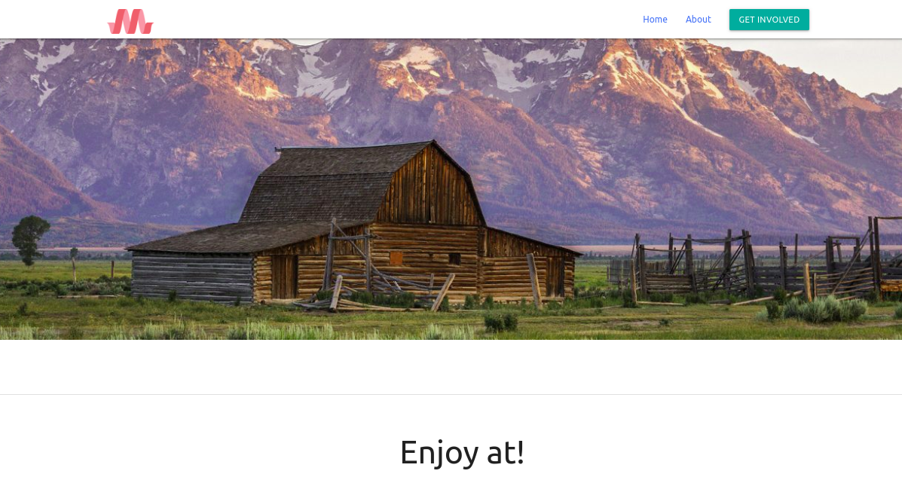

# Materialize css template

## How to use it?
just run the below command in the project directory
### `npm install`

after downloading the Dependeniences, start live-server with below command

### `npm run dev`

